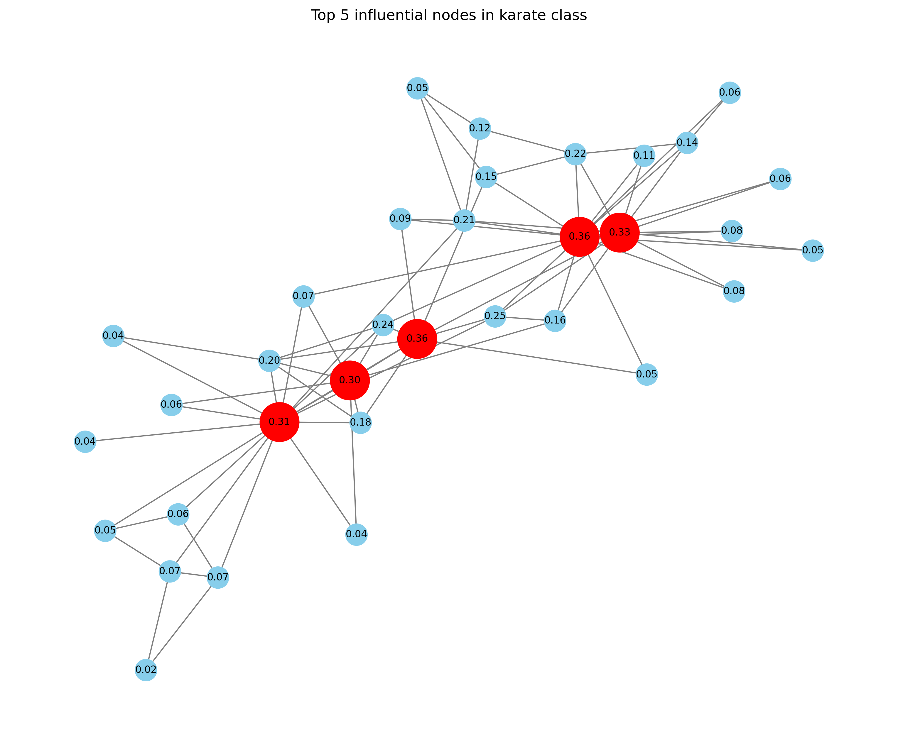

# Eigenvector Centrality on Karate Club Network

## Overview

This project identifies the most influential members in Zachary’s Karate Club network using the concept of **Eigenvector Centrality**.
The method applies the **Power Iteration algorithm** to compute the dominant eigenvector of the network’s adjacency matrix, showing which nodes have the highest influence in the group.

---

## Background

This implementation is based on the model introduced by **Philip Bonacich (1972)** in the paper:
*“Factoring and Weighting Approaches to Status Scores and Clique Identification,”*
*Journal of Mathematical Sociology.*
[DOI: 10.1080/0022250X.1972.9989806](https://doi.org/10.1080/0022250X.1972.9989806)

Bonacich proposed that a node’s importance depends not only on how many connections it has but also on how important its neighbors are.

---

## Requirements

Install the following Python libraries before running the code:

```bash
pip install requirements.txt
```

---

## How to Run

1. Save the script as `.py`.
2. Run it in your terminal:

   ```bash
   python karate_club.py
   ```
3. The program computes eigenvector centrality and highlights the top five influential nodes in red on the network graph.

---

## Example Output

```
Top influential node: 34
```

The generated visualization (`karate_centrality.png`) shows the network with influential nodes marked in red.



## Author

**Prashansa Shrestha**<br/>
Pulchowk Campus, Tribhuvan University<br/>
[079bct061.prashansa@pcampus.edu.np](mailto:079bct061.prashansa@pcampus.edu.np)
